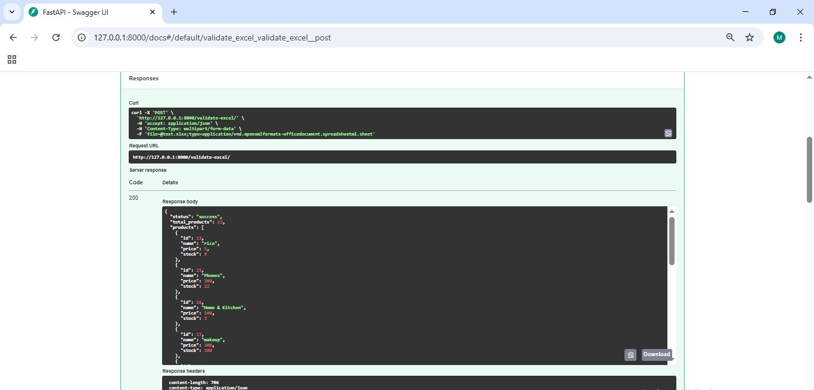

# Inventory Management System

## Overview
The **Inventory Management System** is a hybrid web-based application that combines a **CodeIgniter 4.6.1 (PHP)** admin panel with a **Python FastAPI** backend service.  
It allows businesses to manage products, categories, and inventory levels efficiently, while also providing intelligent services such as image recognition and Excel-based analytics.

This architecture demonstrates how a traditional PHP-based system can be extended with modern Python microservices for advanced functionality.

---

## Features

### CodeIgniter (PHP) Admin Panel
- Product and category management (CRUD operations)  
- Inventory tracking and updates  
- Search and filter functionality 
- Export & Import Excel data (via PhpSpreadsheet Composer package)
- Admin and viewer login system
- Auto-category assignment via Python image recognition  
- Responsive user interface 

### Python (FastAPI) Services
- **Image Recognition** → Upload a product image, automatically predict and assign category  
- **Excel Validation** → Detect schema/format issues in uploaded stock files  
- **Excel Analysis** → Generate summary statistics (average price, low-stock count, etc.)  
- **Excel Graphing** → Generate stock-level graphs in PNG format  

---

## Technologies Used
- **Backend (Admin Panel):** PHP (CodeIgniter Framework)  
- **Backend (Services):** Python (FastAPI, Pandas, PyTorch, TorchVision, Seaborn, Matplotlib)  
- **Frontend:** HTML, CSS, JavaScript, Bootstrap  
- **Database:** MySQL  
- **Tools:** Sublime Text, Visual Studio Code, XAMPP, Uvicorn  
- **Version Control:** Git & GitHub  

---

## Installation and Setup

### 1. CodeIgniter 4.6.1 (PHP) Project
1. Clone or download the repository  
2. Place the project folder inside the `htdocs` directory of XAMPP 
3. Import `inventory_db.sql` file into MySQL using phpMyAdmin 
4. Update database settings in .env 
5. Start Apache and MySQL via XAMPP
6. Access the application:  

[http://localhost/inventory-system/public/login](http://localhost/inventory-system/public/login)


## Login Credentials

### Admin Account
- **Username:** admin  
- **Password:** admin123  

### Viewer Account
- **Username:** viewer1  
- **Password:** viewer123

> These accounts are for demo purposes. Please change/remove them in production.

## Excel Import/Export Feature

### Excel Import/Export
This project supports Excel file import and export for product data.  

The functionality is implemented using the **PhpSpreadsheet** library (`phpoffice/phpspreadsheet`), which is installed via Composer.

#### Installation
Make sure you have Composer installed, then run:

```bash
composer require phpoffice/phpspreadsheet
```
This will create a vendor/ directory and vendor/autoload.php, which are required for using the library.

### Requirements
- PHP >= 7.4
- CodeIgniter 4.6.1 Framework
- Composer installed for Excel import/export ([Installation Guide](https://getcomposer.org/download/))

### Setup
To install dependencies, run:
```bash
composer install
```

### 2. Python (FastAPI) Project
1. Navigate to the `ML_Project/` directory in the project root.  
2. Create a Python virtual environment and activate it:
```bash
python -m venv venv
source venv/bin/activate   # Linux/Mac
venv\Scripts\activate      # Windows
````

3. Install dependencies:

   ```bash
   pip install -r requirements.txt
   ```
4. Start the FastAPI server:

   ```bash
   uvicorn main:app --reload
   ```
5. The service will run on:

   
   http://127.0.0.1:8000/docs (Swagger UI)
   

---

## Project Structure

```
inventory-management-system/
│
├── inventory-system/
│   ├── app/             # Controllers, models, views, config
│   ├── public/          # Public assets (index.php, uploads, CSS/JS)
│   ├── screenshots/     # Project screenshots
│   ├── system/          # Core CodeIgniter files
│   ├── writable/        # Logs, cache, uploads
│   ├── .env             # Environment variables
│   ├── composer.json    # PHP dependencies
│   ├── inventory_db.sql # Database export
│   └── README.md
│
├── ML_Project/          
│   ├── main.py          # FastAPI entry point
│   ├── excel_service.py # Excel validation/analysis functions
│   ├── requirements.txt # Python dependencies

```

---

## Future Work

### Planned Enhancements

* Admin control over user accounts
* User registration and authentication system
* Enhanced input validation and system security
* Reporting and analytics dashboard
* Full integration of Python Excel features into CodeIgniter

### Integration Goals

The following features are **implemented in Python** but **not yet fully integrated** with the CodeIgniter UI:

* Excel Validation
* Excel Analysis
* Excel Graphing

---

## Screenshots

### Dashboard


### Product Management


### Adding Delivery


### Adding a Product


### Category Dropdown


### Category Detection by image


### Excel Analysis via FastAPI

  
*FastAPI returning total products, average price, and low-stock count from an uploaded Excel file.*

### Validate Excel via FastAPI

 

### Stock Graph via FastAPI


### Image Classification via FastAPI


---

## Development Notes

This project was developed as a learning and demonstration tool, showing how **legacy PHP systems** can be extended with **modern Python services**.
AI-assisted tools were used during development to speed up integration and improve code quality.


